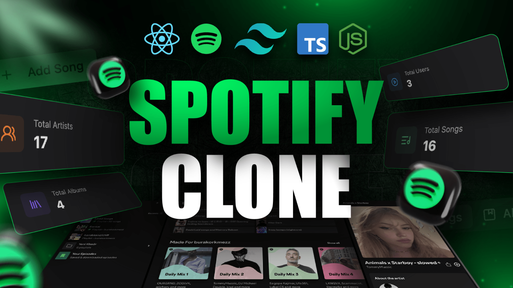

<br />

<div align="center">
  <div>
    
    
    
    
  </div>

  <h3 align="center">Full Stack Spotify Clone</h3>
</div>

### Key pages include:

🏠 **Home Page** for the main content, ⚙️ **Admin Dashboard** for content management, 📑 **Playlist Page** for curated tracks by user, **Album Page** that displays the details related to the album.

---

## **Features & Highlights:**

### 1. **Admin Panel** 🛡️

- ➕➖ Add, edit, or remove **songs**.
- 🏷️ Manage song metadata (title, artist, album, artwork, etc.).
- 🔐 Fully protected and accessible only to admin users.

### 2. **User Playlists** 📂

- 🧍‍♂️ Each user can add or remove their preferred songs in the playlist.
- 🔄 Add/remove songs to/from playlists easily.

### 3. **User Authentication** 🔑

- ✅ Secure login & signup using JWT.
- 🛡️ Protected routes for authenticated users and admin controls.

### 4. **Responsive UI** 📱🖥️

- 🎨 Mobile-first design using **TailwindCSS**.
- 📏 Works smoothly across devices of all screen sizes.

---

## **Pages**

### 1. **Home Page** 🏠

- 🎵 Displays Top Trending Songs.
- ▶️ Playback controls and quick-access playlists.

### 2. **Admin Dashboard** ⚙️

- 📝 Add/remove/update songs and playlists.
- 🗂️ Manage content metadata.

### 3. **Playlist Page** 📑

- 🎼 Shows user-created or admin-curated playlists.
- ➕➖ Songs can be added to and removed from playlists.

### 4. **Search Page** 🔍

- 🧠 Search results based on input query (song name, artist, album).

---

## Desktop View :

 
<br>
 

<br>

 

---

## Mobile View

     

---

## Tech Stack


- **MongoDB**: Stores songs, users, playlists, and metadata.
- **Express.js**: Backend API routing and middleware.
- **React.js**: Frontend UI using functional components.
- **Node.js**: Backend server runtime.
- **Axios**: HTTP requests for data fetching.
- **Tailwind CSS**: Fast and responsive UI styling.
- **Bcrypt.js**: Password hashing.
- **React Hot Toast**: Pop-up notifications.
- **Lucide React**: Modern icons for controls and UI.

---

## Setup :

**Environment Variables (Backend):**  
Create a `.env` file in the `npm run dev` directory and include:

```.env
CLOUDINARY_NAME = "----Enter Cloudinary Name------"
CLOUDINARY_API_KEY = "-----Enter Cloudinary API Key----"
CLOUDINARY_SECRET_KEY = "-----Enter Cloudinary Secret Key----"
MONGODB_URI = "-----Enter MongoDB URI----"
```

## Installation 🛠️ :

You need to install some dependencies using the command terminal so that the code runs smoothly on your device.

### Backend dependencies:

- **bcrypt**  
  `npm install bcrypt`

- **cloudinary**  
  `npm install cloudinary`

- **cookie-parser**  
  `npm install cookie-parser`

- **datauri**  
  `npm install datauri`

- **dotenv**  
  `npm install dotenv`

- **express**  
  `npm install express`

- **jsonwebtoken**  
  `npm install jsonwebtoken`

- **mongoose**  
  `npm install mongoose`

- **multer**  
  `npm install multer`

### 🌐 Frontend dependencies:

- **axios**  
  `npm install axios`

- **react**  
  `npm install react`

- **react-dom**  
  `npm install react-dom`

- **react-hot-toast**  
  `npm install react-hot-toast`

- **react-icons**  
  `npm install react-icons`

- **react-router-dom**  
  `npm install react-router-dom`

---

## Contributing 🤝

All contributions are welcome! If you'd like to add features or fix bugs:

1. Fork the repo
2. Create a new branch
3. Make your changes
4. Commit your changes
5. Push to your fork
6. Submit a pull request

---

## License 📄

MIT License

Copyright (c) 2026 K Tirumala Achari

Permission is hereby granted, free of charge, to any person obtaining a copy
of this software and associated documentation files (the "Software"), to deal
in the Software without restriction, including without limitation the rights
to use, copy, modify, merge, publish, distribute, sublicense, and/or sell
copies of the Software, and to permit persons to whom the Software is
furnished to do so, subject to the following conditions:

The above copyright notice and this permission notice shall be included in all
copies or substantial portions of the Software.

<div align="center">
  
## 👨‍💻 Author
**K Tirumala Achari**  
Full Stack Developer

[](https://github.com/ktirumalaachari)
[](https://ktirumalaachari.vercel.app/)
[](ktirumalaachari@gmail.com)
[](https://www.nist.edu/)

_Computer Science And Engineering Student_  
_NIST University, Berhampur Odisha India_

</div>
